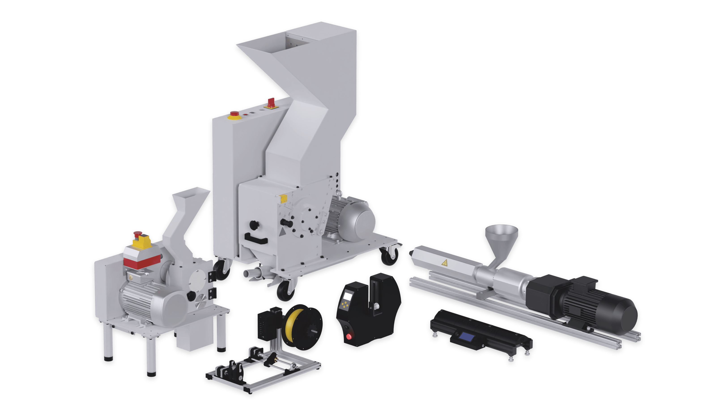

<div id="top"></div>

<!-- PROJECT SHIELDS -->
[![Contributors][contributors-shield]][contributors-url]
[![Issues][issues-shield]][issues-url]
[![Last Commit][commit-shield]][commit-url]
[![GPL-3.0 License][license-shield]][license-url]

<!-- PROJECT LOGO -->
<br />
<div align="center">
  <a href="https://github.com/QiTech-Industries/HardwareControl">
    
  </a>

  <h2 align="center">Hardware Control Library</h2>

  <p align="center">
    Diverse Library to control hardware ranging from PID Heater to Stepper Motor
    <br />
    <a href="https://github.com/QiTech-Industries/HardwareControl/tree/main/documentation"><strong>Explore the docs »</strong></a>
    <br />
    <br />
    <a href="https://github.com/QiTech-Industries/HardwareControl/issues">Report Bug</a>
    ·
    <a href="https://github.com/QiTech-Industries/HardwareControl/issues">Request Feature</a>
    ·
    <a href="https://github.com/QiTech-Industries">Related Projects</a>
  </p>
</div>


<!-- TABLE OF CONTENTS -->
<details>
  <summary>Table of Contents</summary>
  <ol>
    <li>
      <a href="#about-the-project">About The Project</a>
      <ul>
        <li><a href="#built-with">Built With</a></li>
      </ul>
    </li>
    <li>
      <a href="#getting-started">Getting Started</a>
      <ul>
        <li><a href="#installation">Installation</a></li>
        <li><a href="#usage">Usage</a></li>
      </ul>
    </li>
    <li><a href="#roadmap">Roadmap</a></li>
    <li><a href="#contributing">Contributing</a></li>
    <li><a href="#license">License</a></li>
    <li><a href="#contact">Contact</a></li>
  </ol>
</details>


<!-- ABOUT THE PROJECT -->
## About The Project

<div align="center">
  <a href="https://github.com/QiTech-Industries/HardwareControl">
    
  </a>
  </div>

The goal of this project is to become a universal, API consistent library to control all the hardware components you could ever wish for without needing to worry about complex control logic. Basically you must only include one file and ultimately gain access to debounced buttons, stepper motors, dc motors, hall sensors... Despite mircroservices and modules becoming popular, we believe that makers should not have to deal with inconsistent documentations and loads of imports just to get their project working. We are by no means close to such a holy grale yet but the library will grow as we discover new components at QiTech or you add them [Contributing](#contributing)

<p align="right">(<a href="#top">back to top</a>)</p>


### Built With

Currently the following libraries are in use:

| Library          | Info                                      | License |
| ---------------- | ----------------------------------------- | ------- |
| FastAccelStepper | https://github.com/gin66/FastAccelStepper | MIT     |
| TMCStepper       | https://github.com/teemuatlut/TMCStepper  | MIT     |

<p align="right">(<a href="#top">back to top</a>)</p>


<!-- GETTING STARTED -->
## Getting Started

To get a local copy up and running follow these simple steps.

### Installation

These steps are only required if you want to develop the library. In case you just want to use it in one of your projects refer to [Usage](#usage)

1. Install the PlatformIO extension in VsCode `platformio.platformio-ide`
2. Clone the repo
   ```sh
   git clone https://github.com/QiTech-Industries/HardwareControl
   ```
3. Upload the code to the ESP
   ```sh
   npm run dev
   ```
There is also a full mock server available to test the API interaction without having a connection to the Winder. To start it run:

1. Install NPM packages
   ```sh
   cd mock && npm install
   ```
2. Start the server on port `5001` in hot-reload mode
   ```sh
   npm run start
   ```

When reloading the webinterface a green toast should pop up notifying you that the socket connection was successful.

### Usage
<details>
  <summary>Heat Controller</summary>
  
  ```cpp
// main.cpp
/**
 * Example code for using 3 heat-controllers simultaneously
 */
#include <Arduino.h>
#include <HeatController.h>

HeatController heater1({
    .id = 1,
    .targetTemp = 200,
    .pinHeat = 26,
    .pinSensorSo = 16,
    .pinSensorCs = 17,
    .pinSensorSck = 25
});
HeatController heater2({
    .id = 2,
    .targetTemp = 200,
    .pinHeat = 27,
    .pinSensorSo = 13,
    .pinSensorCs = 12,
    .pinSensorSck = 14
});
HeatController heater3({
    .id = 3,
    .targetTemp = 200,
    .pinHeat = 5,
    .pinSensorSo = 18,
    .pinSensorCs = 19,
    .pinSensorSck = 23
});
HeatController controllerList[] = {heater1, heater2, heater3};
int controllerCount = 3;

void setup(){
    Serial.begin(115200);
    // Start controllers with valid configuration
    for(int i=0; i<controllerCount; ++i){
        if(controllerList[i].isReady()) controllerList[i].start();
    }

    // Make some of the controllers talk
    controllerList[0].setDebuggingLevel(WARNING);
    controllerList[controllerCount-1].setDebuggingLevel(INFO);
}

void loop(){
    for(int i=0; i<controllerCount; ++i){
        if(controllerList[i].isReady()) controllerList[i].handle();
    }
    delay(1); // Small delay to prevent message-flooding
}
```

</details>

<details>
  <summary>Stepper Controller</summary>
  
```cpp
// main.cpp
#include "./controller/stepper/Stepper.h"

stepperConfiguration_s stepperConfig = {.stepperId = "stepper",
                         .maxCurrent = 700,
                         .microstepsPerStep = 32,
                         .stepsPerRotation = 200,
                         .mmPerRotation = 10,
                        .gearRatio = 1,
                         .pins = {
                            .en = 12,
                            .dir = 14,
                            .step = 17,
                            .cs = 13,
                        }
};
FastAccelStepperEngine engine = FastAccelStepperEngine();
Stepper myStepper = Stepper(stepperConfig, &engine);

void setup() {
    SPI.begin();
    Serial.begin(115200);
    engine.init();
    myStepper.init();
    myStepper.setDebuggingLevel(INFO);
}

void loop() {
    // Issue command
    myStepper.movePosition(80, 100);

    // Let the handler do its magic
    while(true){
        myStepper.handle();
    };
}
```

</details>


<p align="right">(<a href="#top">back to top</a>)</p>


<!-- ROADMAP -->
## Roadmap

The goal of this project is to become a universal library with options to control nearly all hardware components available for makers wih a unified API. Ideally with only a single import required.

There will definitely be some project restructuring involved and especially at this early stage a new breaking version will get released frequently.

To get an overview of what is planned to be implemented, check the issues where bugs ans feature requests are kept track of. See [open issues](https://github.com/QiTech-Industries/HardwareControl/issues) for a full list. Feel free to report new issues or fix existing ones.

<p align="right">(<a href="#top">back to top</a>)</p>


<!-- CONTRIBUTING -->
## Contributing

Contributions are what make the open source community such an amazing place to learn, inspire, and create. Any contributions you make are **greatly appreciated**.

If you have a suggestion that would make this better, please open a issue with the tag "enhancement" to discuss whether your idea is in line with our Roadmap and we can find the best way of implementing it.

Than:

1. Fork the Project
2. Create your Feature Branch (`git checkout -b feature/AmazingFeature`)
3. Commit your Changes (`git commit -m 'Add some AmazingFeature'`)
4. Push to the Branch (`git push origin feature/AmazingFeature`)
5. Check whether your code complies with the [coding guidelines](documentation/coding_conventions.md)
5. Open a Pull Request

<p align="right">(<a href="#top">back to top</a>)</p>


<!-- LICENSE -->
## License

Distributed under the GPL-3.0 License. See `LICENSE` for more information.

<p align="right">(<a href="#top">back to top</a>)</p>


<!-- CONTACT -->
## Contact

QiTech Industries - [https://qitech.de/industries](https://www.qitech.de/industries) - contact@qitech.de

Project Link: [https://github.com/QiTech-Industries/HardwareControl](https://github.com/QiTech-Industries/HardwareControl)

<p align="right">(<a href="#top">back to top</a>)</p>

<!-- MARKDOWN LINKS & IMAGES -->
<!-- https://www.markdownguide.org/basic-syntax/#reference-style-links -->
[contributors-shield]: https://img.shields.io/github/contributors/QiTech-Industries/HardwareControl?style=for-the-badge
[contributors-url]: https://github.com/QiTech-Industries/HardwareControl/graphs/contributors

[commit-shield]: https://img.shields.io/github/last-commit/QiTech-Industries/HardwareControl?style=for-the-badge
[commit-url]: https://github.com/QiTech-Industries/HardwareControl/commits

[issues-shield]: https://img.shields.io/github/issues/QiTech-Industries/HardwareControl?style=for-the-badge
[issues-url]: https://github.com/QiTech-Industries/HardwareControl/issues

[license-shield]: https://img.shields.io/github/license/QiTech-Industries/HardwareControl?style=for-the-badge
[license-url]: https://github.com/QiTech-Industries/HardwareControl/blob/main/LICENSE
